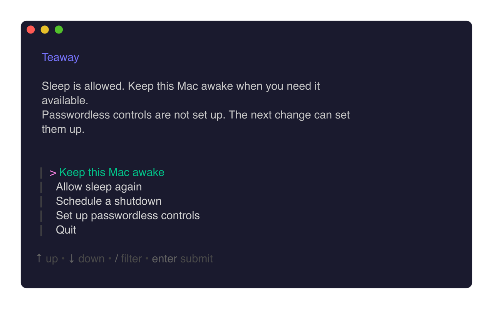
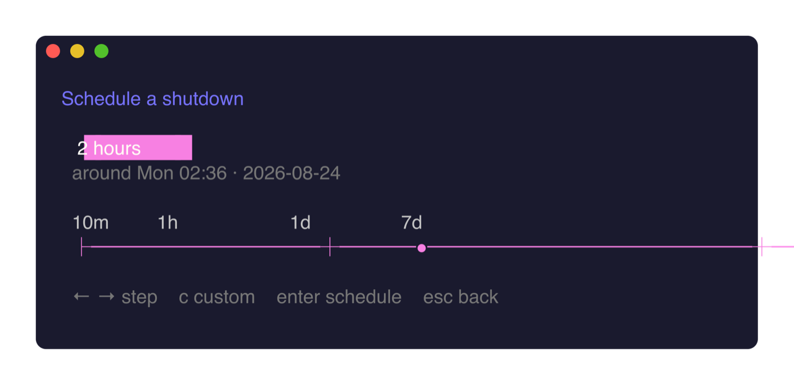

# teaway

<p align="center">
  <a href="https://github.com/soundadam/teaway/actions/workflows/ci.yml"></a>
  <a href="https://github.com/soundadam/teaway/releases/latest"></a>
  <a href="LICENSE"></a>
</p>

<p align="center"><strong>Keep a Mac awake. Restore it when you're done.</strong></p>

<p align="center">
  
</p>

```sh
brew install soundadam/tap/teaway
teaway
```

That's the client. It stays open. Keep the Mac awake — including with the lid
closed — then restore the exact sleep setting it owned.

<p align="center">
  
</p>

Need a script instead?

```sh
teaway on
teaway shutdown after 2h
teaway off
```

macOS 13+. Don't close a MacBook in a bag.

[Product](https://soundadam.com/projects/teaway/) · [Docs](https://teaway.mintlify.app) · [Changelog](CHANGELOG.md) · [Contributing](CONTRIBUTING.md) · [Security](SECURITY.md)
